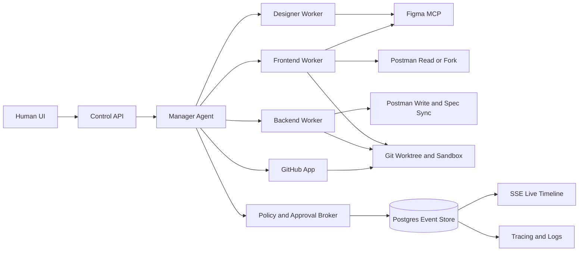

# Technical Compass for an Autonomous Multi-Role Codex System on a VPS

## Executive recommendation

The strongest route for your project is **not** a free-form swarm of agents that all chat with each other equally. The best current pattern is a **manager-centric, artifact-driven system**: a single Manager role owns task intake, planning, approvals, and final integration; narrow specialist workers own bounded execution; and every important handoff is converted into typed artifacts such as PRD deltas, Figma deltas, API contracts, migration plans, diffs, and test evidence. That recommendation aligns with several independent trends in the literature: MetaGPT shows the value of explicit SOPs and role decomposition, ChatDev shows that specialized role communication can work, RTADev shows that **misalignment between agents** is one of the main failure modes and must be actively corrected, and newer scaling work shows that multi-agent systems help mainly on **decomposable** problems while often hurting performance on sequential ones. citeturn17view6turn18view4turn18view6turn19view5turn18view9

For the OpenAI stack, the cleanest architecture today is to use the **Agents SDK** for the Manager and orchestration layer, and to use **Codex as a specialist coding worker** inside that broader workflow. OpenAI’s own docs explicitly distinguish the two layers: the Responses API is best when you want to own the loop yourself, while the Agents SDK is best when you want built-in orchestration, specialist agents with different tools and policies, tracing, and resumable approvals. OpenAI’s Codex docs also explicitly say that when Codex is “one specialist inside a broader orchestrated workflow,” you should expose Codex through MCP and orchestrate it with the Agents SDK. citeturn30view0turn29search18turn30view4

So the practical recommendation is this:

| Layer | Recommended technology | Why |
|---|---|---|
| Manager and orchestration | OpenAI Agents SDK on your server | Built-in handoffs, guardrails, tracing, resumable approvals, specialist separation |
| Long-running and custom API-driven logic | Responses API and background mode where you need direct control | Best when you want to own branching, state, or tool routing |
| Coding workers | Codex SDK for local coding-focused threads, or Codex CLI exposed as MCP for Manager-driven workflows | Best specialist for repo work, plans, diffs, testing, and iterative coding |
| Design worker | Figma MCP | Structured design read access, and controlled write-to-canvas workflows |
| API workspace worker | Postman API | Read, fork, update collections/specs, and keep docs/specs in sync |

That gives you the exact hybrid you asked for: **Codex SDK + API technologies**, but with the architecture split in the right place rather than forcing one tool to do everything. citeturn28view2turn21view0turn30view0turn15view2turn15view4turn15view5turn15view7

## What the research says about systems like yours

The most relevant research does **not** support a “more agents is always better” philosophy. MetaGPT’s main contribution was to encode software-company-like workflows into standardized operating procedures and role-based deliverables; that is directly relevant to your idea of designer, frontend, backend, and manager roles. ChatDev similarly demonstrated that specialized agents can contribute to design, coding, and testing through language-based communication, but it also had to add “communicative dehallucination” to reduce bad coordination. In other words, role separation helps, but communication discipline matters just as much. citeturn17view6turn18view5turn17view7turn18view4

RTADev is especially relevant because it focuses on the failure you will almost certainly hit in production: **agents drifting apart from each other’s intent**. Its core argument is that multi-agent software development fails when architecture, code plan, and implementation become misaligned, and it improves results by introducing real-time alignment checks and conditional review phases. That fits your project very well, because your Designer, Frontend, and Backend workers will otherwise produce artifacts that look locally reasonable but are globally inconsistent. citeturn17view9turn18view6

At the same time, Agentless is the necessary caution. It argues that many software-engineering tasks can be handled with a much simpler three-stage process—localize, repair, validate—without fully autonomous agentic tool loops. That does **not** kill your idea; it sharpens it. You should not spawn the full designer/frontend/backend team for every ticket. You should let the Manager decide the **smallest topology** that can solve the problem: one worker for a localized backend fix, two workers for a UI/API contract change, and the full three-role flow only when the feature truly spans design, frontend, and backend. citeturn17view8turn18view3

That recommendation is reinforced by newer multi-agent scaling research. A large 2025 study found that multi-agent coordination can improve performance dramatically on decomposable tasks, but degrade it sharply on sequential tasks; it also found that independent agents can amplify errors, while more centralized coordination contains them better. The practical takeaway for your system is simple: **use hierarchical orchestration, not peer democracy**. The Manager should remain the control point, and peer-to-peer worker communication should be narrow, typed, and reviewable rather than open-ended. citeturn12search0turn19view2turn19view3turn19view4turn19view5

The benchmark story also matters. SWE-bench remains useful for issue-level coding evaluation, and its Verified split gives you a cleaner engineering benchmark. But real product work is broader than patch generation. OmniCode was introduced specifically because real software development includes more categories than classic patch-fix tasks. So your system should be evaluated with both public coding-agent benchmarks and your own product-native tasks, especially feature additions that include design, docs, endpoint changes, data migrations, and acceptance tests. citeturn18view1turn20view2turn20view3turn20view0

## Selected architecture

The architecture I recommend is a **single durable task workflow** per feature request, owned by the Manager, with specialized workers attached through controlled handoffs. The Manager receives a vague request such as “add this feature,” turns it into a structured work graph, decides whether clarification is required, allocates work to specialists, pauses for approvals when policy says so, and then integrates the outputs into one merge-ready package. That maps very naturally to the Agents SDK, whose agent abstraction explicitly packages instructions, tools, MCP servers, handoffs, guardrails, and structured outputs, and whose runner already supports the agent loop, handoffs, and pauses for approval. citeturn30view2turn30view0turn30view1

The orchestrator should be **durable**, because your workflows are long-running, interruptible, approval-aware, and failure-prone. Temporal is a strong fit here: its workflow executions are durable, reliable, and scalable; they support Signals, Queries, and Updates; and they are explicitly designed for long-running processes that need to pause, resume, and react to outside input safely. In your system, a top-level feature task becomes one Temporal workflow. Human approvals, new constraints, deadline changes, or cancellation requests arrive as Signals or Updates; the website reads status through Queries or your own read model. citeturn15view8turn15view9turn5search7

The persistence layer should be **event-first**, not chat-first. Use PostgreSQL as the system of record for tasks, runs, artifacts, approvals, tool calls, and audit logs. PostgreSQL Row-Level Security is a good future-proofing mechanism if you later support multiple projects or teams, because it restricts row visibility and modification per user or role with default-deny behavior when no policy exists. For real-time propagation to the API/UI layer, PostgreSQL `LISTEN`/`NOTIFY` is enough on a VPS-sized deployment and avoids adding another queue too early. If you later want semantic retrieval across prior tasks, decisions, and artifacts, pgvector lets you keep vector search in the same database as the rest of your relational state. citeturn16view6turn16view7turn26view0

The coding workers should run in **isolated worktrees and sandboxes**, not directly in the same mutable repository. OpenAI’s own Codex products emphasize isolated task environments and parallel worktrees, and the current Codex SDK exposes explicit sandbox modes such as `read_only`, `workspace_write`, and `full_access`. That is exactly what you need on a VPS: one git worktree plus one containerized sandbox per active worker-task pair, beginning at the smallest privilege level and escalating only when policy allows it. citeturn21view1turn21view2turn28view2

## Role and permission design

Here is the role model that best matches your idea while staying technically enforceable.

| Role | Core responsibility | Default tool surface | Human-facing permission |
|---|---|---|---|
| Manager | Intake, decomposition, routing, approvals, integration, final reporting | Agents SDK handoffs, policy broker, read access to project metadata, approval tools, status tools | Yes |
| Designer | Create or update design artifacts and design rationale | Figma MCP read; Figma write only in allowed scopes; artifact publish tool | No |
| Frontend developer | Build UI from approved design/context and connect to backend contracts | Repo sandbox for frontend paths, Figma read, Postman read or fork, preview/test tools | No |
| Backend developer | Build endpoints, migrations, jobs, and API documentation | Repo sandbox for backend paths, Figma read, Postman write/update/spec sync, DB migration tools | No |

That matrix is consistent with current platform capabilities. Figma’s MCP server brings structured design context to agents and now supports writing back to canvas, but Figma’s own help docs make an important distinction: agents can read design components, variables, and layout data broadly, while **write-to-canvas requires write-capable setup**, and Dev seats have read-only access outside drafts whereas Full seats are required for broader write workflows. That strongly suggests using a **dedicated Designer service identity** for write access, while Frontend and Backend workers should normally remain Figma-read-only. citeturn22view1turn22view2turn15view5turn15view6

For Postman, the clean split you described is feasible. Collections are the core unit for storing and sharing API requests and workflows; documentation is generated from collections; and OpenAPI specs can be generated from a collection and kept in sync. Postman also supports **forking without Editor access**, which is perfect for the Frontend worker: it can read the canonical API workspace, or work in a fork, without mutating the source of truth. The Backend worker, by contrast, should be the only role allowed to update the canonical collection or synced specification. citeturn23view3turn23view4turn23view1turn23view0

For GitHub, prefer **GitHub Apps** over OAuth apps. GitHub’s own docs recommend GitHub Apps because they use fine-grained permissions, short-lived tokens, and give more control over which repositories the app can access. Also, GitHub Apps start with no permissions by default, which is exactly what you want. The catch is that GitHub’s permission model is repository-, organization-, and account-scoped, not path-scoped, so you should enforce path-level restrictions in your own broker and sandbox mounts, then use GitHub rulesets and status checks to protect trunk branches and require validated integration before merge. citeturn17view1turn17view2turn6search2turn6search3turn6search15

One more design rule matters a lot: **credentials should never sit inside worker prompts or generated code paths**. MCP client best practices explicitly recommend that the host broker keep authorization tokens and credentials rather than exposing them to model-generated code. That means your system should have a central credential broker that injects short-lived access only at tool-call time, records the grant, and never puts raw secrets into the model context. citeturn24view3turn24view1

## Human confirmation strategy

Your requirement that the system should know when to stop is exactly right, and the current tooling supports that directly. OpenAI’s guardrails and human review guidance distinguishes automatic validation from **human-in-the-loop approvals**, and explicitly positions approvals as the pause point before sensitive side effects such as edits, shell commands, and sensitive MCP actions. MCP guidance also says clients should prompt for user confirmation on sensitive operations, show tool inputs before calling servers, validate results, and keep audit logs. citeturn30view1turn17view3

The right operating rule is **bounded autonomy**:

| Situation | Default behavior |
|---|---|
| Purely internal, reversible, sandboxed actions | Continue automatically |
| External or irreversible side effects | Pause for approval |
| High ambiguity or conflicting evidence | Ask a clarifying question |
| Confidence below threshold or tests incomplete | Pause with evidence package |
| Any request involving secrets, permissions, publishing, or destructive data change | Mandatory approval |

This policy is not just prudence; it is the correct response to current agent-security realities. OWASP identifies prompt injection as the top LLM application risk, and OWASP’s agentic guidance emphasizes that autonomous systems expand the risk surface because they plan, act, and call tools. NIST’s generative AI profile likewise frames trustworthiness and risk management as lifecycle concerns, not one-time prompt concerns. So your Manager should treat **user input, worker output, and tool output as potentially confusable or malicious**, and stop whenever a meaningful side effect crosses a risk boundary. citeturn11search0turn11search4turn17view4turn17view5

Only the Manager should speak to humans. That should not be a social convention; it should be enforced in the tool surface. Workers should not have any human-output channel at all. They should only be able to publish typed artifacts, request a decision, or ask the Manager for missing constraints. This accomplishes three things at once: it reduces noise for the human, centralizes policy enforcement, and sharply limits the blast radius of prompt injection or cross-tool contamination. That design also matches the broader least-privilege principle from NIST: restrict privileges to the minimum necessary for each task. citeturn14search0turn29search19turn24view3

The approval object itself should be structured. Every pause should produce a machine-readable evidence bundle with fields such as `risk_class`, `requested_action`, `why_now`, `affected_artifacts`, `expected_user_visible_change`, `destructive_change`, `tests_passed`, `coverage_delta`, `rollback_plan`, and `recommended_default`. OpenAI Structured Outputs is a strong fit here because it guarantees adherence to your JSON schema, which is exactly what you want for a UI that renders approval cards and for a Manager that must distinguish “approval required” from “approval optional” reliably. citeturn16view0

## API and realtime control plane

If you want a website that is comfortable for both humans and agents, the backend should expose a **task control API** and a **live event stream**, not just a transcript endpoint. At minimum, the system should model `Task`, `Run`, `Artifact`, `ApprovalRequest`, `ToolInvocation`, `WorkerAssignment`, and `EvaluationResult` as first-class resources. The Manager receives a top-level task through the API, creates a durable run, and emits typed events as the workflow progresses. That design matches both the Responses/Agents model of typed output items and the observability model you need for a serious autonomous build system. citeturn21view3turn30view0turn30view3

For browser updates, start with **Server-Sent Events** rather than WebSockets. SSE is a standard HTTP-based server-to-client stream, and it is a very natural fit for AI progress, logs, status timelines, and notifications. FastAPI now documents SSE directly, and OpenAI’s own streaming responses documentation also frames HTTP streaming as SSE. Use WebSockets only if you later need bidirectional, low-latency operator consoles or collaborative agent terminals in the browser. For your first version, most of your traffic is “server pushes progress to human,” which is SSE territory. citeturn16view3turn16view2turn16view4

The event vocabulary should be explicit and boring. Good event names would include `task_intake_started`, `clarification_required`, `plan_published`, `design_delta_requested`, `frontend_run_started`, `backend_run_started`, `artifact_published`, `approval_requested`, `approval_granted`, `tests_completed`, `contract_mismatch_detected`, `integration_ready`, `merge_ready`, and `run_closed`. If those events are emitted as structured payloads, your website can render a timeline, filters, diff views, and approvals without rebuilding meaning from raw chat. Structured Outputs is again the right primitive for this part. citeturn16view0

Observability should be built in from day one. The Agents SDK already emits structured traces containing model calls, tool calls, handoffs, guardrails, and custom spans, and OpenTelemetry gives you the wider system correlation model across traces, logs, and metrics. Concretely, every top-level task should have one global `trace_id`; every worker run should be a child span; every tool call should inherit that context; and every log line or approval record should store `trace_id`, `span_id`, `task_id`, and `run_id`. That gives you a replayable, debuggable history instead of a pile of uncorrelated logs. citeturn30view3turn16view5turn27view0turn27view1

## Phased roadmap and evaluation

The safest build path is incremental. Start with a Manager and one coding worker, prove the control plane, then add true multi-role behavior only after you can observe and govern it.

| Phase | What you build | What “done” looks like |
|---|---|---|
| Foundation | Task API, event store, Manager, one Codex worker, git worktree isolation, approval API | One feature-sized backend-only task can run end to end with pause/resume and full audit trail |
| Role specialization | Add Designer and Frontend workers, Figma read integration, Postman read/fork integration | A UI feature with new endpoint can produce design-aware FE and BE changes from one task |
| Canonical artifact flow | PRD delta, design delta, API contract, migration plan, acceptance checklist as typed objects | Workers no longer depend on free-form chat history to coordinate |
| Governance and hardening | Approval policies, secret broker, tool-allow lists, role-specific GitHub Apps, branch protections | Sensitive actions are paused, logged, and resumable; no worker can escalate itself |
| Realtime product layer | Website timeline, approvals UI, artifact browser, replay, run comparison, operator controls | Humans can assign, route, approve, reject, and inspect runs in real time |
| Evaluation and scale | Public benchmarks plus internal product benchmarks, latency/cost dashboards, failure taxonomy | You can measure improvement, not just feel it |

This phased route is justified by both the current tools and the research. OpenAI’s SDK stack now supports specialist agents, handoffs, tracing, guardrails, and resumable approvals directly; Codex can be used as a specialist inside broader workflows; and durable workflow engines such as Temporal are specifically designed for pause/resume and external signal patterns. Meanwhile, the software-agent research literature repeatedly shows that coordination quality matters more than raw agent count. citeturn30view0turn30view1turn30view3turn30view4turn15view8turn15view9turn19view5

For evaluation, do not rely on one benchmark. Use **SWE-bench Verified** for issue-style coding rigor, **SWE-bench Multimodal** and **Multilingual** if your project spans UI or non-Python stacks, **SWE-rebench** for a more continuously refreshed and decontaminated view, and **OmniCode** for broader software-development categories. But your most important eval suite should be internal and product-native: tasks that require new pages in Figma, new endpoints, database tables, updated Postman docs, and acceptance criteria. That is the benchmark shape that actually matches your product vision. citeturn20view2turn20view3turn20view4turn20view0

The most important internal metrics will not just be “did it code something.” They should include: percentage of tasks completed without human intervention; percentage of tasks that paused when they **should** have paused; approval false positives and false negatives; branch-protected merge success; regression rate after merge; number of clarifying questions per task; design/backend/frontend contract mismatch rate; end-to-end cycle time; and cost per accepted feature. Those are the metrics that tell you whether you are building not just an autonomous coder, but an autonomous **software factory** with governance. That emphasis is consistent with the current push in both operational agent platforms and software-agent research toward traces, evaluation loops, and controlled deployment rather than raw demo autonomy. citeturn30view3turn29search17turn17view5

The bottom line is this: your project should be built as a **governed, manager-led, artifact-driven multi-specialist system**, not as a chat room of autonomous personas. Use the Agents SDK for orchestration, use Codex as the coding specialist, use Figma MCP and Postman as role-scoped capability surfaces, use durable workflow semantics for pause/resume, and make the website a live control plane over typed events and approvals. That route fits the current OpenAI platform, the current Figma/Postman capability model, and the strongest findings from the multi-agent software-engineering literature. citeturn30view0turn30view4turn22view1turn23view1turn19view5turn18view6